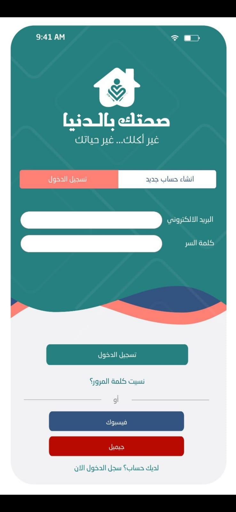

# 🌱 Nutrition App

A powerful and personalized nutrition app designed to create customized diet plans based on user input. This app leverages a series of tailored questionnaires to understand users' dietary needs and preferences, ensuring the most suitable diet plan is provided.

## 🚀 Features

### 🔐 Authentication
- **Signup with Google**: Quick and secure signup using Google authentication.
- **Login**: 
  - Login with Google
  - Login with email and password
- **Forgot Password**: Simple password recovery process via email.

### 📋 Personalized Questionnaire
- **Multi-step Questionnaire**: Users complete a series of questions, providing essential data to tailor diet plans.
- **Dynamic Input**: Users can enter data or select options as needed, with each questionnaire tailored to gather specific nutritional information.
- **Result-driven**: The collected data is analyzed to offer a personalized diet plan that suits individual needs.

## 🛠️ Tech Stack
- **Architecture**: MVVM (Model-View-ViewModel)
- **Frontend**: Xamarin
- **Backend**: Azure Cosmos DB with MongoDB API

## 🖼️ Screenshots
Here are some key features of the app:

### Authentication Process
1. **Signup Screen**  
   

2. **Login Screen**  
   

3. **Forgot Password Screen**  
   

### Questionnaire Flow
4. **Questionnaire Introduction**  
   

5. **Question Input Screen 1**  
   

6. **Question Input Screen 2**  
   

7. **Diet Plan Result Screen**  
   

## 💡 How It Works
1. **User Signup/Login**: Users can sign up or log in via Google or email/password.
2. **Complete Questionnaires**: After authentication, users answer a series of questions to help determine their dietary needs.
3. **Receive a Diet Plan**: Based on the responses, the app provides a customized diet plan.

## 📚 Documentation
- **Xamarin Documentation**: [Xamarin Official Docs](https://docs.microsoft.com/en-us/xamarin/)
- **Azure Cosmos DB Documentation**: [Azure Cosmos DB Docs](https://docs.microsoft.com/en-us/azure/cosmos-db/)

## 🤝 Contributors
- **[Aseel Hamayel]** - Backend Authentication Feature, Questionnaire Implementation
- **[Sana Eid]** - Frontend Authentication Feature, Questionnaire Implementation
